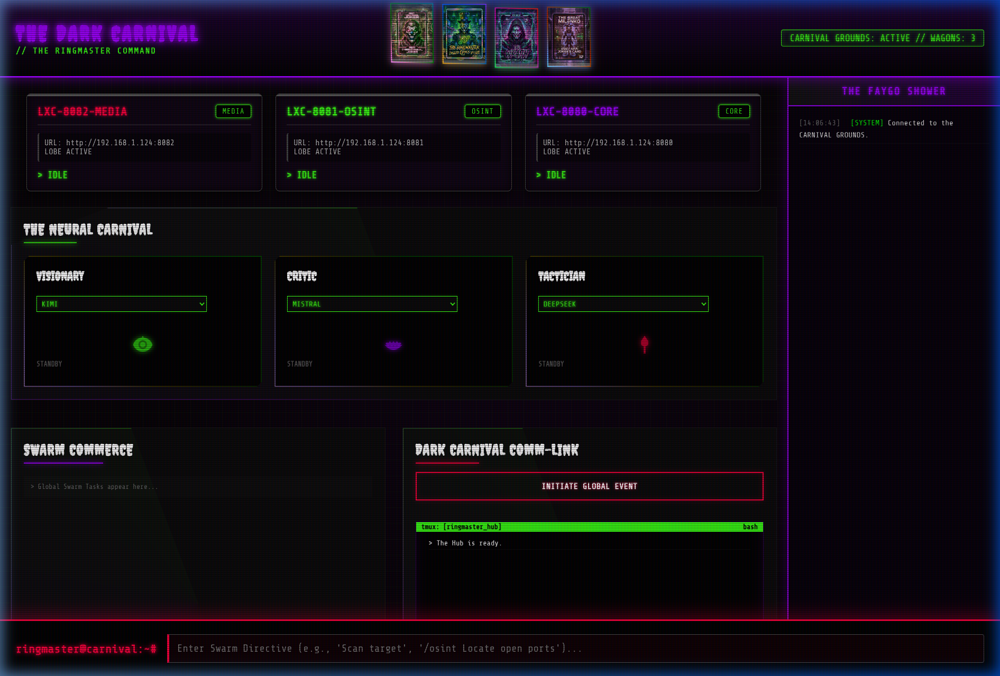

# 🎪 The Dark Carnival Protocol

> *"Every Clown Has A Purpose. Every Node Has A Role."*

**The Dark Carnival Protocol** is a highly scalable, Hub-and-Spoke autonomous AI agent swarm designed for bare-metal and containerized environments (Proxmox). It replaces a single monolithic AI agent with a decentralized, adversarial debate swarm — routing objectives to specialized edge nodes across your entire infrastructure grid.

---

## 🃏 V1 Showcase — The Ringmaster Hub


*The live command center: 3 Wagons online, Neural Carnival debate agents loaded, and the Faygo Shower global log running in real-time.*

### ✨ Hub Features
- **Holographic Joker's Cards** — 4 animated 3D avatar holograms (Cyber Joker, Ringmaster, Wraith, Milenko)
- **CCTV Wagon Wall** — Live grid of all registered Swarm nodes with real-time status
- **The Neural Carnival** — Select LLM models per debate role (Visionary, Critic, Tactician) and launch coordinated swarm attacks
- **Swarm Commerce** — Live task list of global swarm execution progress
- **Dark Carnival Comm-Link** — Central command terminal with `INITIATE GLOBAL EVENT` button
- **Completions & Cognition Vault** — Browse, analyze, and manage completed swarm payloads
- **The Faygo Shower** — Real-time global log feed from all connected Wagons
- **Ambient Static Audio** — Web Audio API powered dark carnival atmosphere (click to activate)
- **`[ 👁 INTERVENE ]`** — Human-in-the-loop override when a Wagon hits `AWAITING HUMAN`

---

## 🧠 How The Swarm Thinks

Unlike a standard GPT wrapper, every `Objective` dispatched through this protocol triggers a **Multi-Agent Adversarial Debate**.

On the Edge Nodes, three LLM personas battle it out:
1. **The Visionary** — Drafts the massive, unconstrained approach. Default: `Kimi`
2. **The Critic** — Rips the plan apart: security flaws, bottlenecks, and risks. Default: `Mistral`
3. **The Tactician** — Synthesizes the wreckage into a concrete, scoped execution plan. Default: `DeepSeek`

When the debate concludes, the Edge Node flashes `AWAITING HUMAN` back to the Hub, where the **`[ 👁 INTERVENE ]`** button appears for the human overlord to Approve, Inject, or Abort.

---

## 🏗️ Architecture

```
[ Ringmaster Hub :8000 ]
         |
    ┌────┴────┐
    │  FastAPI │  ← WebSocket broadcast to all UI clients
    │ + WS     │  ← Receives Node heartbeats & dispatches Objectives
    └────┬─────┘
         │  HTTP /api/swarm/dispatch
    ┌────┴────────────────────────┐
    │  Edge Nodes (Spokes)        │
    │  LXC-CORE   :8080           │
    │  LXC-OSINT  :8081           │
    │  LXC-MEDIA  :8082           │
    └─────────────────────────────┘
```

### The Ringmaster (Hub)
Lightweight FastAPI + WebSocket server. Zero AI logic. Tracks nodes, routes directives, and broadcasts real-time state to the GUI.

### Edge Nodes (Wagons / Spokes)
Node.js/TypeScript runtime deployed in Proxmox LXC containers. Auto-register to the Ringmaster on boot. Run the full Visionary → Critic → Tactician debate loop.

---

## 🚀 Quick Start

### Boot The Hub
```bash
./launch_ringmaster.sh
```
*Visit `http://localhost:8000` to access the Ringmaster Command Center.*

### Boot An Edge Node
```bash
# ./launch_node.sh <PORT> <ROLE>
./launch_node.sh 8081 OSINT
```

### Proxmox Automation
```bash
./proxmox_swarm_boot.sh
```
*(Deploy this into your Proxmox Golden Image Template container to auto-register all clones on boot.)*

---

## 🔒 Environment Variables

Place a `.env` file in the `Self-R/` directory. A template is provided at `Self-R/.env.example`.

```env
NODE_ID="LXC-DarkCarnival"  # Unique ID for this Wagon

AZURE_API_KEY="..."
KIMI_ENDPOINT="..."
MISTRAL_ENDPOINT="..."
DEEPSEEK_API_KEY="..."
# See .env.example for the full list
```

---

*Built with FastAPI · Node.js · WebSockets · Web Audio API · Proxmox LXC*
