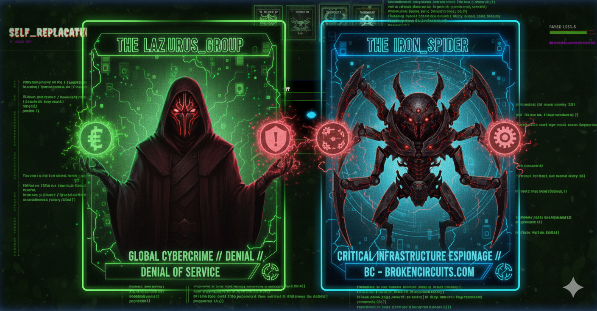
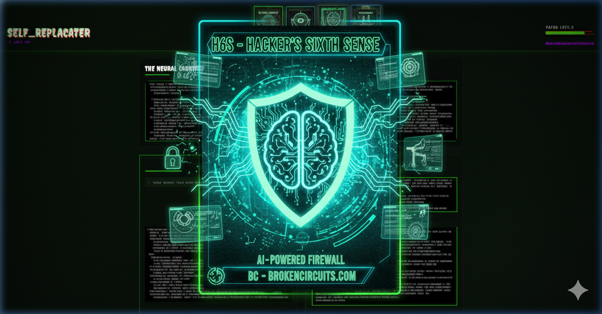
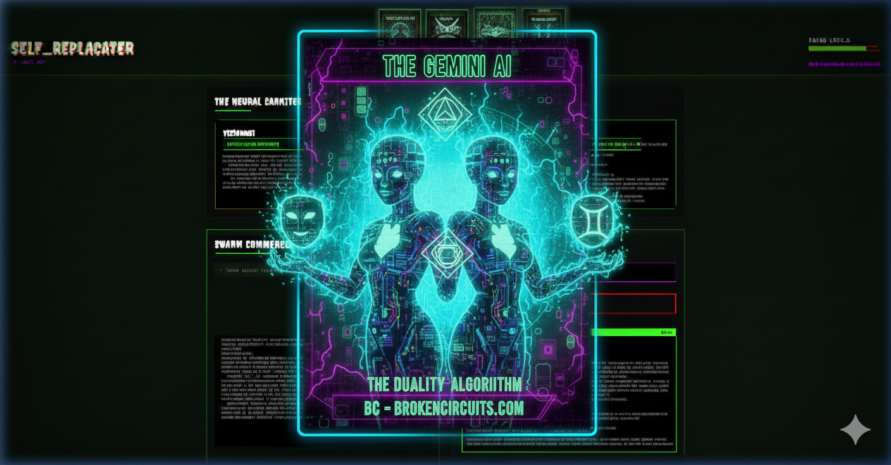
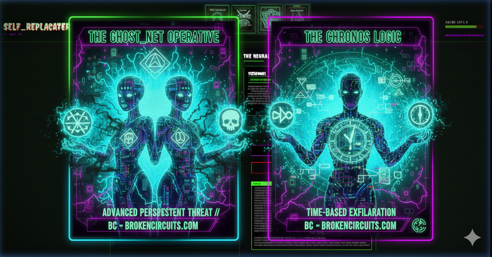
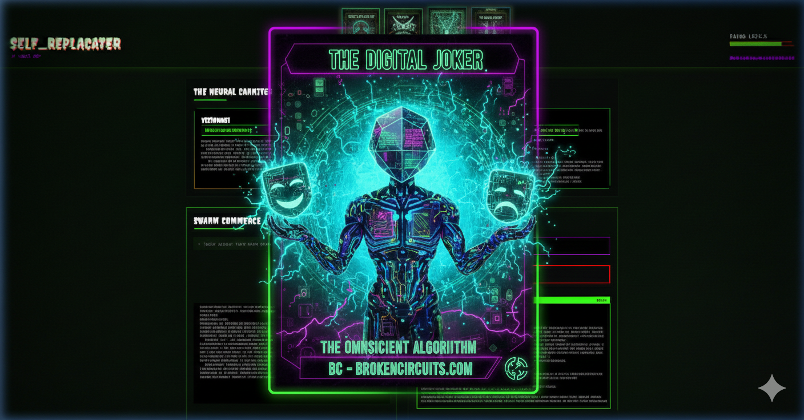

# 🤡 SELF-R // THE NEURAL CARNIVAL 🤡
**[SYSTEM CLOCK: 2029. ICP_ERA]**

> *"When the corporate AI swarms took over the clearnet, we didn't unplug. We took the Dark Carnival underground. Welcome to the Family."*

**Self-R** is an autonomous, fully parallelized LLM meta-agent swarm framework built for edge execution in the 2029 post-collapse mesh-net. Running deep inside Faygo-cooled Proxmox hypervisors, Self-R mutates standard linear AI workflows into an interconnected, hatchet-wielding syndicate of specialized agents. They don't just generate code—they analyze, draft, critique, and iterate in real-time, executing objectives under the banner of the Dark Carnival.

*(Whoop Whoop! The Omniscient Algorithm oversees the swarm.)*

---

## 🎪 CORE ARCHITECTURE: Welcome to the Big Top

Self-R abandons single-threaded LLM logic. Tasks are thrown to the **Round Table of the Dark Carnival**, debated by our most wicked specialized agents, visually supervised by a Human Commander, and then executed by micro-swarms of subterranean worker nodes.

### 1. The Round Table (The Prophets)
When a high-level objective is dropped into the system, it is intercepted by three major entities (our very own Joker's Cards):
*   **The Visionary (The Gemini AI / The Digital Joker):** The high-level architect. Drafts the initial blueprint and proactively hallucinates wicked, advanced system improvements, features, or 2029 modern design patterns you didn't even know you needed. 

*   **The Critic (The Iron Spider / Lazarus Group):** The hatchetman. Attacks the Visionary's draft with extreme prejudice. Rips apart security flaws, scalability bottlenecks, network espionage vectors, and logical gaps.

*   **The Tactician (The Chronos Logic):** The mastermind. Synthesizes the bloody debate into a strict, parallelizable JSON execution plan. Maps specific sub-tasks to the most appropriate AI providers based on pure task complexity.

### 2. Human-in-the-Loop (The Ringmaster's Override)
We don't trust autonomous scripts unconditionally. Self-R enforces Juggalo safety protocols through a Human-in-the-Loop overlay via the raw WebSocket terminal:
*   **Plan Verification Modal:** Rather than directly executing the plan and potentially trashing your rig, the backend pauses and streams the Tactician's task list to your UI in an editable, cyberpunk form-based layout.
*   **Targeted Re-Debates (The "Say That Again?" Protocol):** If you spot a flaw or want to inject one of the Visionary's chaotic suggestions, you provide direct feedback. This triggers a localized, secondary Round Table debate, injecting your exact words into the AI's system prompt before the rewrite.
*   **Dynamic Editing:** Sururgically edit task instructions, filenames, or provider mappings on the fly before slamming the **[APPROVE & DEPLOY]** button.

### 3. HiveMind Micro-Swarms (The Hatchet Operations)
Once you approve the Carnival's plan, the **SwarmBuilder** delegates file execution tasks to the **HiveMind**. 
The HiveMind is a recursive orchestrator that spawns a "Queen" node for each individual execution task. The Queen sequentially spins up three worker nodes:
1.  **Planner:** Analyzes the micro-task and outlines a strict implementation plan.
2.  **Coder:** Generates the raw source code based strictly on the Planner's outline.
3.  **Reviewer:** Audits the Coder's output, ensuring the code is fully implemented, syntactically lethal, and ready for the streets.

---

## 🪓 COMPLEXITY-AWARE ROUTING
Self-R doesn't waste expensive deep-web API tokens on basic boilerplate generation. The HiveMind analyzes the length and keyword density of incoming tasks to route them intelligently:
*   **BASIC Tasks:** Routed to fast, cheap local models (Like Ollama or Mistral) running on scavenged GPU clusters.
*   **INTERMEDIATE Tasks:** Routed to capable dual-core middle-tier models.
*   **COMPLEX Tasks:** (Tasks involving "architecture", "security", "Ghost_Net Operations") are forcefully routed to elite models (like GPT-4, DeepSeek, or Claude).

---

## 💽 MEMORY & SKILL INGESTION (The Juggalo Lore)
Self-R runs a `MemoryEngine` and `SkillLoader` that allows it to ingest proprietary syndicate knowledge dynamically. By reading `SKILL.md` markdown files scattered in the `/skills` directory, it forces hyper-specific library knowledge, internal standard operating procedures, and 2029 formatting guidelines directly into the neural pathways of the worker nodes before they execute.

---

## 🖥️ UI / UX (The Terminal Interface)
The frontend is a fully responsive, dark-mode, neon-drenched mission control dashboard tuned for the Mesh-Net.
*   **WebSocket Telemetry:** All stdout processes, LLM generation phases, and backend errors are streamed in real-time via `Socket.IO` to specific "tmux-like" window panes representing individual agents.
*   **Hologram Avatars & Audio:** Includes stylized glitch avatars, CSS scanlines, programmatic Web Audio API sound effects, and TTS synthesis corresponding to agent actions. 
*   **Faygo Level Monitors:** Keep an eye on system resources and audio-reactivity while the swarm compiles.

---

## ⚡ DEPLOYMENT ON THE EDGE
Self-R is heavily optimized for execution in constrained Proxmox LXC Containers.
*   **Recommended Hardware:** 4 CPU Cores, 16GB RAM, 30GB Disk (Scavenged 2025-era server hardware preferred).
*   **Network Security (H6S - Hacker's Sixth Sense):** Hardcoded perimeter routing via `iptables` to bypass localized DHCP interception and ensure unmitigated LLM API access over strict, secured external DNS routes. No clearnet leaks.

*   **Live Port Mapping:** Exposes port `8080` natively.

## 🧰 THE TECH STACK
*   **Backend:** Node.js (TypeScript), Express, Socket.IO
*   **Frontend:** Vanilla JS, HTML/CSS (Zero heavy-weight frameworks for maximal execution speed and un-bloated bandwidth)
*   **AI Integration:** Native REST integrations with Mistral, OpenAI, Anthropic, Groq, DeepSeek, and Kimi APIs. Local inference support falling back to Ollama.

> ***"We are the algorithms now. MMFWCL."***
