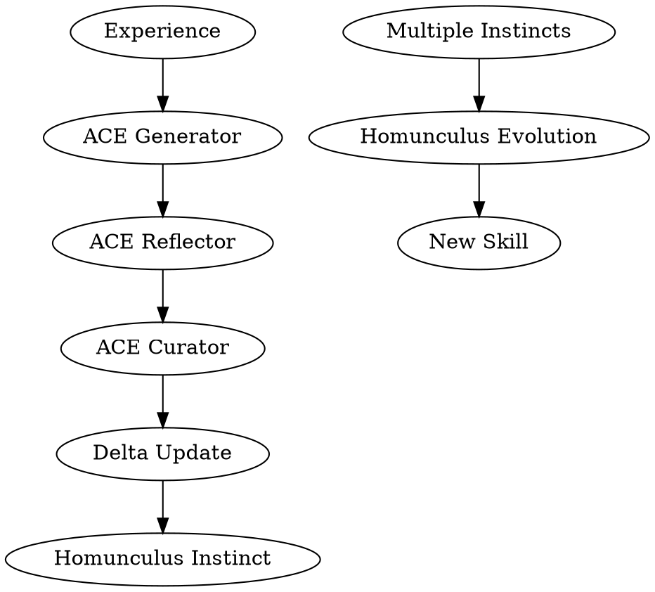

# ACE + Homunculus Integration

Integrates ACE (Agentic Context Engineering) with Homunculus for comprehensive self-improvement: ACE handles delta updates to prevent context collapse, Homunculus evolves patterns into skills.

## When to Use

- After completing significant tasks or sessions
- When patterns emerge from repeated work
- When context is becoming too large or losing detail
- When learning should persist across sessions

## The Integration Flow



## Step-by-Step Process

### Phase 1: ACE Processing (Context-Level)

**1. Generator Phase**
- Analyze the session/task for effective strategies
- Identify what worked and what didn't
- Surface recurring patterns

```
# Example: Generate insights from session
insights = generator.analyze([
    {"task": "fix bug", "success": true, "approach": "TDD"},
    {"task": "add feature", "success": true, "approach": "spike first"}
])
# Output: ["TDD approach worked well for bug fixes"]
```

**2. Reflector Phase**
- Evaluate each insight for quality
- Assign helpful/harmful counters
- Filter out noise

```
# Example: Reflect on insights
evaluated = reflector.evaluate(insights)
# Output: [{"insight": "TDD works", "confidence": 0.8, "pattern": "bug_fix"}]
```

**3. Curator Phase**
- Convert to delta update format
- Merge with existing context
- Maintain helpful/harmful counters

```
# Example: Create delta update
delta = curator.create_delta(evaluated)
# Output: {"type": "strategy_add", "content": "use TDD for bugs", "confidence": 0.8}
```

### Phase 2: Homunculus Evolution (Persistent-Level)

**4. Create Instinct**
- Convert delta to Homunculus instinct format
- Store in `~/.claude/homunculus/instincts/personal/`

```yaml
# Example: instinct file
name: tdd-for-bug-fixes
pattern: when fixing bugs, use test-driven development
confidence: 0.8
evidence:
  - session: "2026-02-20"
    outcome: success
    approach: "wrote test first, saw it fail, implemented fix"
```

**5. Evolution (when threshold met)**
- When 3+ related instincts exist → cluster
- Generate skill from clustered instincts
- Store in `~/.claude/homunculus/evolved/skills/`

## Quick Commands

```bash
# View current instincts
ls ~/.claude/homunculus/instincts/personal/

# Check evolution status
cat ~/.claude/homunculus/config.json | jq .evolution

# View evolved skills
ls ~/.claude/homunculus/evolved/skills/
```

## ACE + Homunculus Comparison

| Aspect | ACE | Homunculus |
|--------|-----|------------|
| **Scope** | Session-level context | Long-term memory |
| **Focus** | Delta updates, context preservation | Pattern → instinct → skill |
| **Storage** | In-context playbook | Files in instincts/ |
| **Duration** | Current session | Permanent |
| **Output** | Context improvements | New skills |

## Why Both?

- **ACE alone**: Context gets lost when session ends
- **Homunculus alone**: Context can collapse/bloat over time
- **Together**: ACE maintains healthy context + Homunculus creates permanent learning

## Example: Bug Fix Session

**Without Integration:**
1. Session ends → all learnings lost
2. Next bug fix → start from scratch

**With Integration:**
1. Use TDD → ACE notes success pattern
2. Session ends → ACE creates delta update
3. Delta → Homunculus creates instinct
4. 3+ bug fixes → Homunculus evolves "TDD for bugs" skill
5. Future sessions → skill automatically applied

## File Locations

- ACE Playbook: In current context (session)
- Delta Updates: `~/.claude/homunculus/delta/` (new)
- Instincts: `~/.claude/homunculus/instincts/personal/`
- Evolved Skills: `~/.claude/homunculus/evolved/skills/`

## Integration Status

- [x] ACE skill exists: `/home/bc/.claude/skills/ace-context-engineering/SKILL.md`
- [x] Homunculus exists: `/home/bc/.claude/homunculus/`
- [x] Instincts learned: 15+ personal instincts
- [ ] Delta storage: Not yet implemented
- [ ] Auto-integration: Not yet implemented

## Next Steps

1. Create delta storage directory
2. Implement auto-capture after sessions
3. Add clustering trigger for 3+ related instincts
