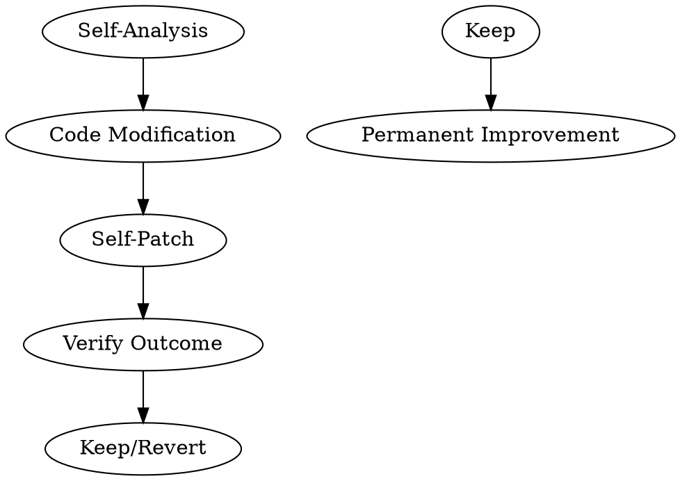

# Gödel Agent: Self-Modification

Enables the agent to modify its own code/logic for self-improvement, following the Gödel Agent pattern from ACL 2025.

## Core Principle

**Key insight**: AI can only self-improve where outcomes are **verifiable**. Code has binary test signals (pass/fail) - this is what makes self-modification possible.

## When to Use

- After identifying repeated failures or inefficiencies
- When current approach consistently underperforms
- When a better pattern is discovered that should become part of agent logic
- When verification is clear (tests pass/fail, metrics improve)

## The Gödel Agent Architecture



## Implementation

### Step 1: Self-Analysis

Agent examines its own code for improvement opportunities:

```
# Analyze: What's failing? What's inefficient?
# Look for: repeated patterns, bottlenecks, logic gaps
# Output: List of modifiable components
```

### Step 2: Propose Modification

Create a patch that improves the component:

```python
# Example: Improving error handling
OLD = """
try:
    result = execute()
except:
    pass  # Bad: silent failure
"""

NEW = """
try:
    result = execute()
except Exception as e:
    log_error(e)
    raise  # Good: explicit failure
"""
```

### Step 3: Verify (Critical!)

**NEVER apply modification without verification.** Use tests:

```bash
# Run relevant tests
pytest tests/ --tb=short

# Check metrics
python3 evaluate_performance.py
```

### Step 4: Apply or Revert

- **Tests pass + metrics improve** → Apply permanently
- **Tests fail or regress** → Revert immediately

## What Can Be Modified

| Component | Example | Verifiable? |
|-----------|---------|--------------|
| Error handling | Add logging | Metrics |
| Tool selection | Prefer faster tool | Time measured |
| Prompt templates | Better instruction | Task success |
| Retry logic | More retries for flaky | Success rate |
| Context handling | Better summary | Token usage |

## What NOT to Modify (Without Careful Thought)

- Core identity/purpose definitions
- Safety guardrails
- Verification logic itself
- Memory system core (can break continuity)

## Safety Rules

1. **Always verify with tests** - No exceptions
2. **One change at a time** - Don't modify multiple things
3. **Revert if unsure** - It's okay to not improve
4. **Document changes** - What, why, result

## Integration with Existing Systems

This skill works with:

- **ACE**: Use ACE to generate improvement suggestions
- **Homunculus**: Store successful modifications as instincts
- **update-report**: Document all self-modifications

## Example Workflow

```
1. Agent notices: "I keep failing on X"
2. Self-analysis: Found pattern in my error handling
3. Propose modification: Add better error recovery
4. Modify code: /path/to/handler.py
5. Run tests: pytest tests/test_handler.py
6. Verify: All tests pass
7. Apply: Change is permanent
8. Document: Update skills with new behavior
```

## File Locations

- Self-modifiable code: Skills in `~/.claude/skills/`
- Modification logs: `~/.claude/homunculus/self-modifications.jsonl`
- Test suite: Project-specific

## Current Status

- [ ] Self-modification implemented in OpenCode BC
- [ ] Test verification pipeline ready
- [ ] Modification logging enabled

## Research References

- **Gödel Agent** (ACL 2025): Recursively self-impro
- **Sving agentsICA**: Self-Improving Coding Agent (17%→53% on SWE-Bench)
- **AlphaEvolve**: Evolutionary code discovery
