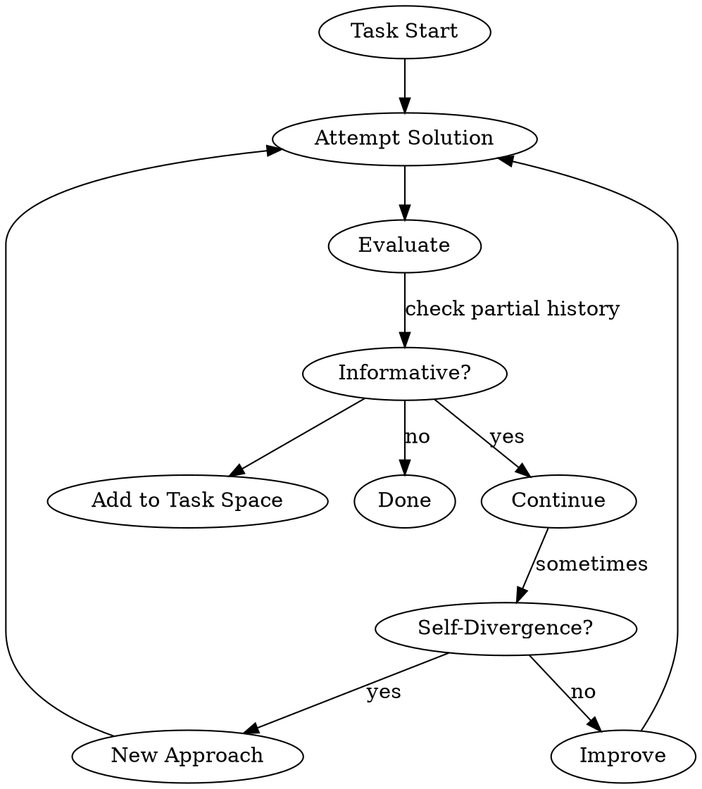

# Exploratory Iteration (ExIt)

Implements autocurriculum learning that enables multi-step self-improvement at inference-time, following the ExIt framework from arXiv:2509.04575.

## Core Concept

Instead of fixed K-step improvement, ExIt:
- Dynamically grows task space from intermediate states
- Selects most informative partial histories for continuation
- Supports "self-divergence" for diversity

## When to Use

- When tasks require multiple revision attempts
- When fixed iteration depth is inefficient
- When exploring different solution approaches is beneficial
- For: math problems, tool-use, ML engineering tasks

## The ExIt Architecture



## Implementation Components

### 1. Task Space Bootstrap

```python
# Store intermediate states for potential reuse
task_space = []

def on_intermediate_state(state, outcome):
    # Only store informative states
    if is_informative(state):
        task_space.append({
            'state': state,
            'outcome': outcome,
            'value': compute_value(state, outcome)
        })
```

### 2. Selective Sampling

```python
# Prioritize high-value partial histories
def sample_starting_point():
    # Use variance-based selection
    candidates = [t for t in task_space if t['value'] > threshold]
    return weighted_sample(candidates)
```

### 3. Self-Divergence

```python
# Try different approach when stuck
def self_diverging_attempt(solution):
    # Prompt to take a significantly different approach
    return f"""
        Previous approach didn't work well.
        Try a fundamentally different strategy.
        Consider: {alternative_strategies}
    """
```

## Integration with Existing Systems

This skill combines with:

| System | Integration Point |
|--------|-------------------|
| **ACE** | Use Curator's delta as iteration signal |
| **Homunculus** | Store successful iterations as instincts |
| **Gödel** | Use modifications as new strategies |

## ExIt Workflow Example

```
Task: "Fix this bug"

Iteration 1: Try TDD approach
  → Partial state captured (test written)
  → Not informative enough → continue

Iteration 2: Try different debugging
  → Found root cause (informative!)
  → Added to task space

Iteration 3: Self-divergence
  → Try completely different hypothesis
  → Works! Solution found

Iteration 4: Verify fix
  → Tests pass
  → Record successful pattern
```

## Metrics to Track

| Metric | Purpose |
|--------|---------|
| Iteration depth | How many attempts |
| Self-divergence rate | Diversity exploration |
| Task space growth | Learning accumulation |
| Success rate | Overall performance |

## File Locations

- Task space storage: `~/.claude/homunculus/task-space/`
- Iteration logs: `~/.claude/homunculus/iterations.jsonl`
- ExIt config: `~/.claude/homunculus/config.json` (add exit section)

## Current Status

- [ ] ExIt framework designed
- [ ] Task space storage implemented
- [ ] Self-divergence prompts ready
- [ ] Metrics tracking pending

## Research References

- **Bootstrapping Task Spaces for Self-Improvement** (arXiv:2509.04575)
- **ExIt**: Autocurriculum RL for inference-time self-improvement
- Applied to: competition math, multi-turn tool-use, ML engineering
